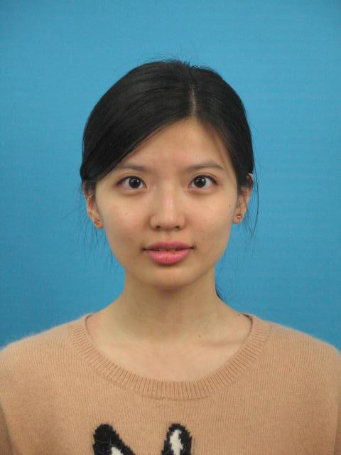

# pockerface

本项目本意是通过卷积神经网络构建一个模型，通过人脸训练来自动识别美丑，但是写完之后发现训练的结果完全没有任何效果，也就放弃本来的打算，做了一个平均脸生成程序。

## 数据准备

所有的图片都来自上海毕业生图像采集网，13年的时候网站有漏洞，跟风下载过一些，图片大小为640*480，背景单调且均为正脸照，图片如下：

因为本来是做人脸训练用的，所以专门还写了一个简单的桌面程序judge.py方便给每个人打上漂亮还是不漂亮的标签，同时调用face++的API接口把人脸的关键点找出来存放在face.sqlite中。

## 平均脸生成

原理见[http://www.learnopencv.com/average-face-opencv-c-python-tutorial/](http://www.learnopencv.com/average-face-opencv-c-python-tutorial/)， 代码也是讲里面的示例稍微修改，关键点采用face++检测结果，最后把自己觉得漂亮的49张照片的平均脸生成结果如下：

